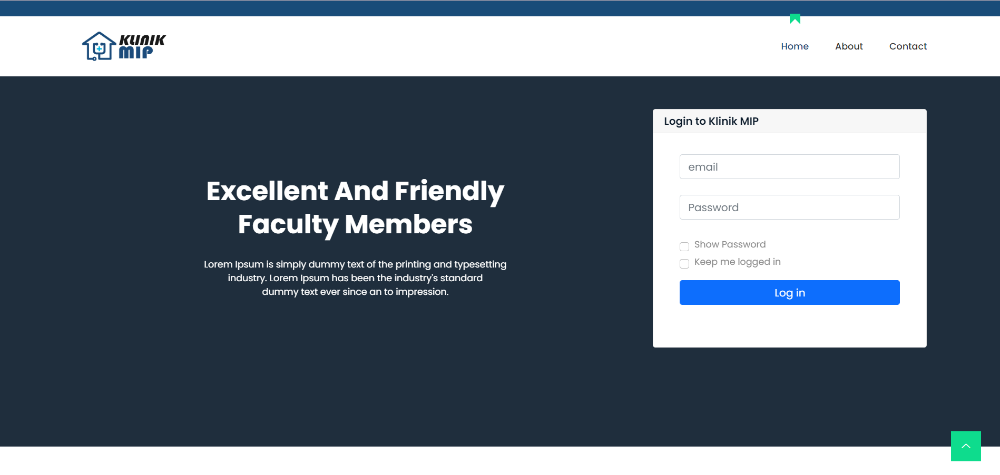
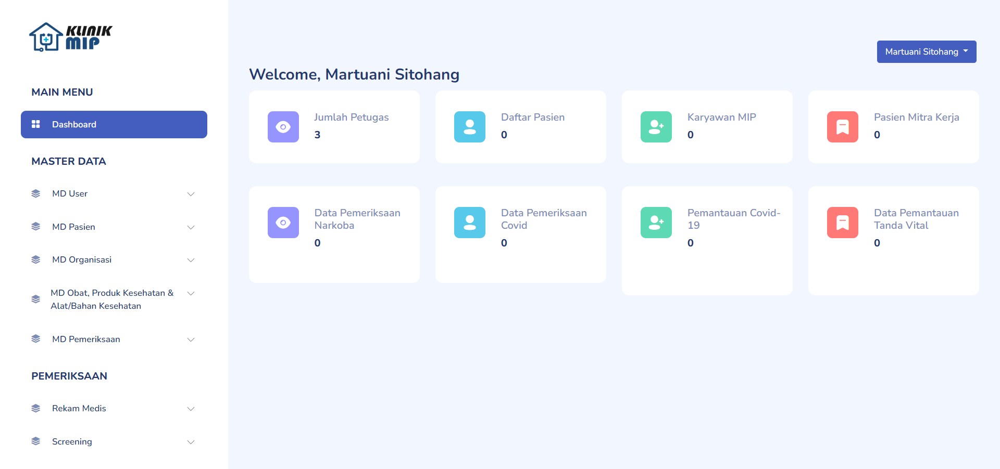

# Sistem Klinik kesehatan | Laravel + Bootstrap + javascript

Sistem klinik kesehatan merupakan sistem yang berbabasis web yang berfungsi untuk kebutuhan layanan kesehatan pasien dan segala bentuk yang berkaitan dengan pasien

## Fitur

- Mobile Responsive Bootstrap Design
- Role Petugas & Mitra
- Data Pasien
- Data Obat & Resep
- Data Rekam medis
- Surat menyurat
- dll

## Teknologi

**Client:** HTML, CSS, JavaScript, Bootstrap 

**Framework:** PHP, Laravel 

**DataBase:** MySql

## AKSES REPOSITORY

**HALAMAN HALAMAN UTAMA**

**INVENTARIS DASHBOARD**

## Feedback

Berikan feedback atau Ingin Memproleh SourceCode:

**EMAIL DEVELOPER :** 

mikozua45@gmail.com

